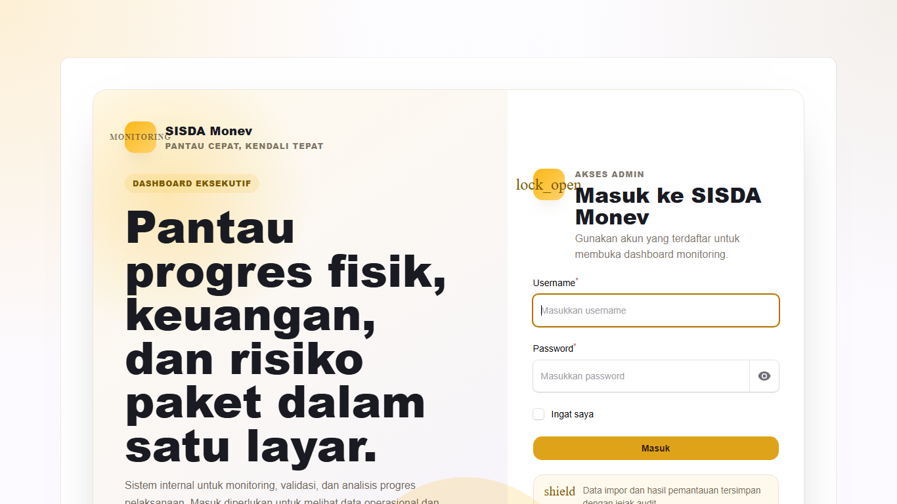
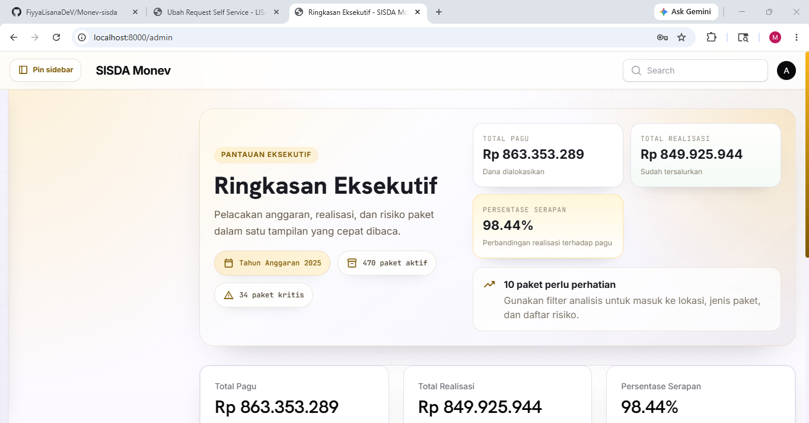

# SISDA Monev

Dashboard monitoring progres fisik, keuangan, dan risiko paket berbasis Laravel + Filament. Aplikasi utama berada di folder `laravel-progres-dashboard/`, didukung dokumen desain, catatan workflow, dan visual referensi di root repository.

> Dokumentasi ini tidak menyertakan kredensial. Akun akses dikelola melalui administrator sistem atau modul Manajemen User.

## Preview

| Login Screen | Admin Dashboard |
| --- | --- |
|  |  |

## Navigasi Cepat

| Saya ingin... | Baca bagian |
| --- | --- |
| Membuka aplikasi utama | [Struktur Repo](#struktur-repo) |
| Melihat modul yang tersedia | [Mulai Dari Sini](#mulai-dari-sini) |
| Mengecek update terakhir | [Fitur Terbaru](#fitur-terbaru) |
| Melihat riwayat perbaikan | [Bug Fix Log](#bug-fix-log) |
| Memahami role akses | [Peran Pengguna](#peran-pengguna) |
| Menjalankan lokal | [Instalasi Lokal](#instalasi-lokal) |
| Menjalankan validasi | [Testing](#testing) |

## Struktur Repo

| Path | Isi |
| --- | --- |
| `laravel-progres-dashboard/` | Aplikasi utama Laravel Filament. |
| `laravel-progres-dashboard/docs/screenshots/` | Visual login dan admin dashboard untuk README. |
| `Dashboard Design/` | Referensi visual awal dashboard. |
| `dashboardproject.md` | Catatan progres kerja. |
| `workflow_agent_laravel_progres_ta2025.md` | Workflow teknis pengembangan. |
| `dummy.xlsx` | Contoh data import lokal. |

## Status Project

| Area | Status |
| --- | --- |
| Dashboard eksekutif | Siap digunakan |
| Import batch Excel | Siap digunakan |
| Risk scoring | Siap digunakan |
| Popup detail paket | Sudah dirapikan |
| Sidebar auto-hide | Sudah aktif di desktop |
| Manajemen user | Sudah tersedia untuk Admin |
| Dokumentasi kredensial | Sudah dibersihkan |
| Automated test | 7 test aktif |

## Mulai Dari Sini

| Kebutuhan | Buka Modul | Yang Bisa Dilakukan |
| --- | --- | --- |
| Melihat kondisi umum | Ringkasan Eksekutif | Pantau total pagu, realisasi, serapan, dan paket berisiko. |
| Fokus pada paket bermasalah | Paket Berisiko | Lihat daftar paket Kritis dan Perlu Perhatian, lalu buka detail paket. |
| Analisis per wilayah | Analisis Lokasi | Bandingkan progres berdasarkan lokasi pekerjaan. |
| Analisis per jenis pekerjaan | Analisis Jenis Paket | Baca pola risiko berdasarkan kategori paket. |
| Kelola data dasar | Master Data Paket | Telusuri paket hasil import dengan filter dan pencarian. |
| Import data Excel | Import Batches | Unggah dan audit proses import data progres. |
| Kelola akses | Manajemen User | Admin dapat menambah, mengubah role, dan mengelola akses user. |

<details>
<summary><strong>Alur cepat untuk pengguna dashboard</strong></summary>

1. Buka Ringkasan Eksekutif untuk melihat kondisi umum.
2. Masuk ke Paket Berisiko jika ada paket Kritis atau Perlu Perhatian.
3. Klik detail paket untuk membaca status, gap, progres fisik, progres keuangan, dan metadata utama.
4. Gunakan Analisis Lokasi atau Analisis Jenis Paket untuk mencari pola risiko.
5. Gunakan sidebar auto-hide agar area tabel lebih luas saat bekerja di desktop.

</details>

<details>
<summary><strong>Alur cepat untuk admin data</strong></summary>

1. Siapkan akun dan role lewat Manajemen User.
2. Import data Excel melalui Import Batches.
3. Cek hasil import dan audit trail.
4. Review dashboard setelah import selesai.
5. Jika data sumber salah, koreksi file Excel lalu import batch baru.

</details>

## Fitur Terbaru

- Login page kustom dengan branding SISDA Monev, tanpa branding Laravel.
- Sidebar desktop auto-hide dengan tombol pin agar area kerja bisa melebar penuh.
- Popup detail paket dibuat ringkas, informatif, dan tidak terpotong di layar desktop.
- Modul Manajemen User untuk role Admin dan Operator.
- Akses panel dibatasi role: Admin dan Operator dapat masuk panel, Manajemen User hanya untuk Admin.
- README dibersihkan dari kredensial dan instruksi login sensitif.

## Bug Fix Log

| Area | Masalah | Perbaikan |
| --- | --- | --- |
| Login | Branding bawaan framework masih muncul. | Login page diganti dengan tampilan SISDA Monev penuh dan branding framework disembunyikan. |
| Login | Placeholder username menampilkan contoh akun sensitif. | Placeholder diganti menjadi teks netral. |
| Login | Ringkasan data operasional tampil di halaman publik login. | Informasi statistik paket dan progres dihapus dari halaman login. |
| Sidebar | Tombol hide sidebar belum membuat konten utama melebar. | Sidebar auto-hide dibuat keluar dari flow layout dengan posisi fixed, lalu area konten dan topbar dipaksa full width. |
| Sidebar | Sidebar perlu tetap bisa dipanggil saat tersembunyi. | Ditambahkan mode hover dan tombol pin/auto-hide. |
| Popup Detail Paket | Modal detail terpotong karena posisi terlalu tinggi. | Posisi modal diturunkan dan scroll internal disesuaikan. |
| Popup Detail Paket | Modal terlalu besar untuk pembacaan cepat. | Konten modal dipadatkan tanpa menghapus informasi status, risiko, progres, dan detail utama. |
| Popup Detail Paket | Teks bantuan di modal terasa menempel dan mengganggu. | Teks deskriptif tambahan dihapus dari header modal. |
| Dashboard | Tahun anggaran mengikuti tahun sistem, bukan data import terakhir. | Tahun anggaran diambil dari import batch terbaru yang selesai diproses. |
| Role Operator | Operator valid tetapi belum bisa masuk panel admin. | Model User ditambahkan aturan akses panel untuk role Admin dan Operator. |
| Manajemen User | Operator berpotensi melihat menu pengelolaan user jika akses tidak dibatasi. | Manajemen User dilindungi policy, hanya Admin yang bisa akses. |

## Peran Pengguna

| Role | Akses |
| --- | --- |
| Admin | Mengakses dashboard, import data, analisis, dan Manajemen User. |
| Operator | Mengakses dashboard dan modul monitoring, tanpa akses Manajemen User. |

## Aturan Bisnis

| Area | Aturan |
| --- | --- |
| Cleaning data | Angka rupiah, koma desimal, titik ribuan, dan persen dinormalisasi sebelum dihitung. |
| Data kosong | Nilai kosong, `nan`, dan tanda `-` diperlakukan sebagai data kosong. |
| Anti double counting | Baris `TOTAL`, `SUBTOTAL`, atau baris tanpa lokasi/kode tidak diproses sebagai paket detail. |
| Risk scoring | Status risiko dihitung dari serapan, progres fisik, dan gap fisik-keuangan. |
| Audit trail | Data mentah import disimpan dan koreksi dilakukan dari file sumber. |

## Instalasi Lokal

<details open>
<summary><strong>Setup development</strong></summary>

```bash
cd laravel-progres-dashboard
composer install
npm install
npm run build
cp .env.example .env
php artisan key:generate
php artisan migrate:fresh --seed
php artisan serve
```

Aplikasi berjalan di:

```text
http://localhost:8000/admin
```

</details>

## Perintah Harian

| Tujuan | Command |
| --- | --- |
| Masuk folder aplikasi | `cd laravel-progres-dashboard` |
| Menjalankan aplikasi | `php artisan serve` |
| Menjalankan queue import | `php artisan queue:work` |
| Reset database lokal | `php artisan migrate:fresh --seed` |
| Menjalankan test | `php artisan test` |
| Build aset frontend | `npm run build` |

<details>
<summary><strong>Checklist sebelum push</strong></summary>

- Jalankan `php artisan test`.
- Pastikan README tidak memuat kredensial.
- Pastikan screenshot dokumentasi tidak menampilkan data akses.
- Pastikan perubahan UI sudah dicek di browser desktop.
- Pastikan role Operator tidak punya akses ke Manajemen User.

</details>

## Testing

Suite test mencakup:

- Validasi cleaning data progres.
- Deteksi paket detail.
- Perhitungan metrik dan risk scoring.
- Redirect panel admin.
- Akses role Operator terhadap panel dan Manajemen User.

Jalankan dari folder aplikasi:

```bash
cd laravel-progres-dashboard
php artisan test
```

## Catatan Keamanan

- Jangan menulis username, password, token, atau kredensial lain di README.
- Gunakan environment variable, secret manager, atau prosedur internal untuk distribusi akses.
- Akun dan role operasional dikelola melalui modul Manajemen User.

---

SISDA Monev - Pantau Cepat, Kendali Tepat.
